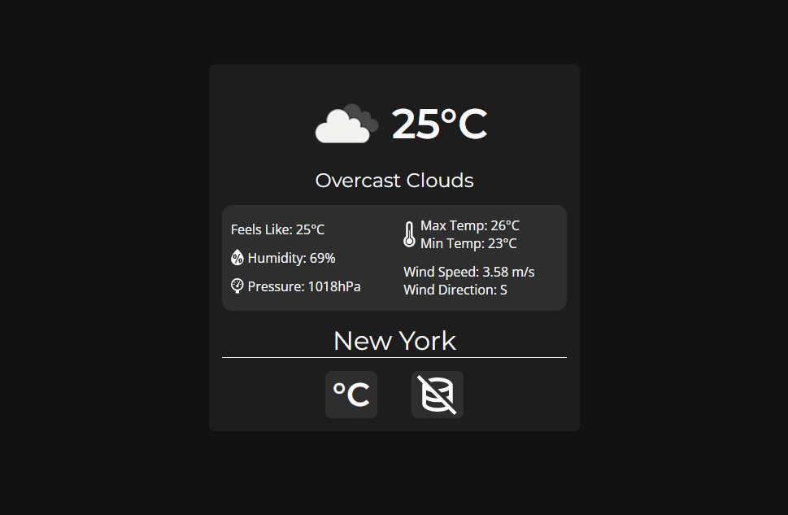

# 

A simple weather site that displays todays weather. Fetches data provided by the [OpenWeather Weather API](https://openweathermap.org/api). An OpenWeather API key is required for use.

# Getting Started

Before anything, you should create an account on [OpenWeather](https://openweathermap.org/) to get access to your own API key.

Once you have an API key, you can either fork/clone this repo, or just head over to my own github pages [weathr site](https://alejandromontalvo.github.io/weathr/).

If you're worried about your API key getting leaked/stolen, you can go ahead and make a temporary alternative key, which you can delete after you've used the site.

# Overview

Below is an overview of each file within this project:

## Root Directory

`index.html` - The defualt website page. All aspects of the site are brought together within this file.

## Script Directory

`script.js` - Includes the main logic behind fetching and displaying the data.

## Style Directory

`style.css` - A simple stylesheet that makes everything look pretty.
